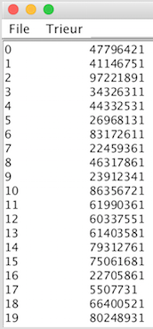
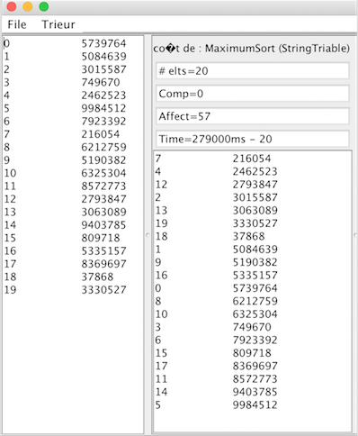
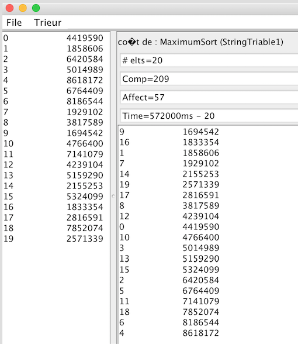

Compte rendu TP4 : TRI
======================

Brought to you by Rémi GATTAZ & Aymeric VIAL-GRELIER

Introduction
------------
Les objectifs n° 0,1,2, 3, 4, 5, 6 sont à réaliser dans cet ordre

Les objectifs facultatifs suivants peuvent être traités dans n'importe quel ordre.
- Objectif 7  : un autre tri, n'introduit rien de nouveau
- Objectif 8  : une généralisation
- Objectif 9  : diversification des modèles de "triable"
- Objectif 11 : une réflexion sur les coûts
- Objectif 10 : génération et analyse des coûts.

Les objectifs 9 et 11 sont les plus intéressants


Objectif 0 :
------------
La classe Tri actuelle est capable de gérer n'importe quel type de donnée. Par contre, étant donnée
que ceci est possible grace a une polymorphisme avec la classe Objet, il n'est pas possible
d'assurer que les objets utilisés ou retournés par les fonctions sont compatibles ou équivalents.

Par exemple, rien ne garantit pour la fonction
``protected abstract Object[] sort(Object[] t,Comparator c);``
que l'Objet comparator est capable de trier les objets dans le tableau T. Rien ne garantit non plus
que le tableau retournée par la fonction sera du même type que celui passé en paramètre.


Nous avons donc rajouté de la généricité (horizontale) pour assurer ceci. Nous avons alors obtenu
les méthodes suivantes dans la classe Trier.
```java
protected abstract <T> T[] sort(T[] t,Comparator<T> c);
public <T> T[] trier(T[] t, Comparator <T> c){ ... }
protected static <T>int verifier(T[] t,Comparator<T> c){ ... }
```
Avec cette version, nous assurons que dans le cadre de chaque fonction, le type T est le même.

Dans l'interface triable, nous avons pu constanter le même problème. En revanche, cette fois,
Il fallait pouvoir assure que les Objets retournées et utilisés par les fonctions étaient tous du
même type. Nous avons donc rajouté une généricité (verticale) sur l'interface pour obtenir :
```java
public interface Triable <T> {
	public T newInstance();
	public Comparator<T> comparator();
	public String toString(T o);
	public long count();
	public void resetCount();
}
```

Avec cette version, nous assurons que le type T utilisé par toutes les fonctions est le même.

Objectif 1 :
------------
Nous avons crée la classe StringTriable. Cette classe implémente l'interface Triable<String>. Il a
donc fallu définir toutes les fonctions se trouvant dans l'interface dans la classe. C'est à dire :
- public String newInstance() : retourne une String comme étant un nombre aléatoire entre 1 et 10 000 000
- public Comparator<String> comparator() : retourne le comparator standard de String
(String.CASE_INSENSITIVE_ORDER)
- public String toString(String aString) : retourne la string passé en paramètre
- public long count() : non utilisé, cette fonction retourne simple 0.
- public void resetCount() : non utilisé, cette fonction ne fait rien

Ensuite, en utilisant le programme Trier et la classe StringTriable, nous avons pu alors obtenir des
collections d'objets Triables.



Objectif 2 :
------------
Nous avons crée la classe MaximumSort. Nous l'avons ensuite utilisé pour trier des StringTriable et
avons obtenu le résultat suivant :



Ce résultat est correct. En effet, la fonction de comporaison que nous utilisons proviens de String.
Il s'agit donc d'un tri lexicographique.

Objectif 3 :
------------
Avec une nouvelle version de StringTriable utilisant un Comparator qui trie par ordre croissant, on
obtient le résultat suivant :



Pour réaliser le compteur, nous avons rajouté dans la classe StringTriable1$Comparator un attribut
compteur. A chaque fois que la méthode compare est appelé, ce compteur est incrémenté. Il est
ensuite possible de récupérer sa valeur ou la remettre à 0 en uitlisant les fonctions count et
resetcount.

Pour pouvoir utiliser ce méchanisme de compteur, il a fallut également rajouter un attribut
pComparator qui est un objet du type StringTriable1$Comparator. Ceci permet de toujours retourner le
même comparator lors de l'appel à la fonciton comparator de cette classe. Les méthodes count et
resetcount de la classe utilisent alors les méthodes du même nom de pComparator.

Objectif 4 :
------------
Dans cet algorithme, il est effectué ${(n-1)*n\over2}$ tests de comparaison. Il a donc un complexité
$O(n^2)$

Avec 20 éléments, on doit obtenir ${(20-1)*20\over2} = 190$ tests de comparaison. C'est bien ce que
l'on a obtenu.

Avec 40 éléments, on doit obtenir ${(40-1)*40\over2} = 780$ tests de comparaison. C'est encore bien
ce que l'on a obtenu.

Objectif 5 :
------------

Les améliorations sur l'agorithme de Heapsort n'ont pas été faites.

Objectif 6 :
------------


